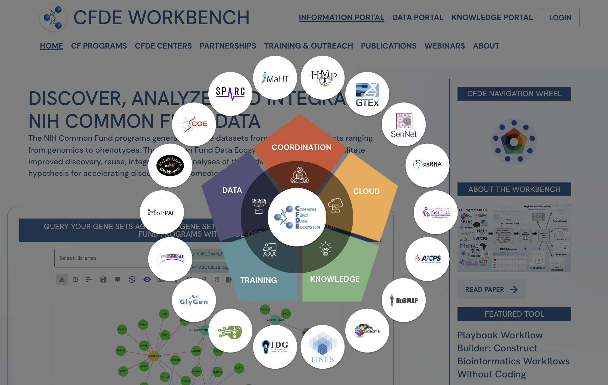

# CFDE Navigation Wheel

This package adds the CFDE Navigation Wheel to your site:


## Installation
```
npm install git+ssh://github.com/MaayanLab/cfde-wheel
```

## Usage

```
import CFDEWheel from 'cfde-wheel'

export const MyComponent = () => {
	return <CFDEWheel/>
}
```

Note for Next.js: This is a client component so you need to add `'use client'` in the file.

## Run Storybook

```
npm run storybook
```
This should open `http://localhost:6006/` where you can view the component.
